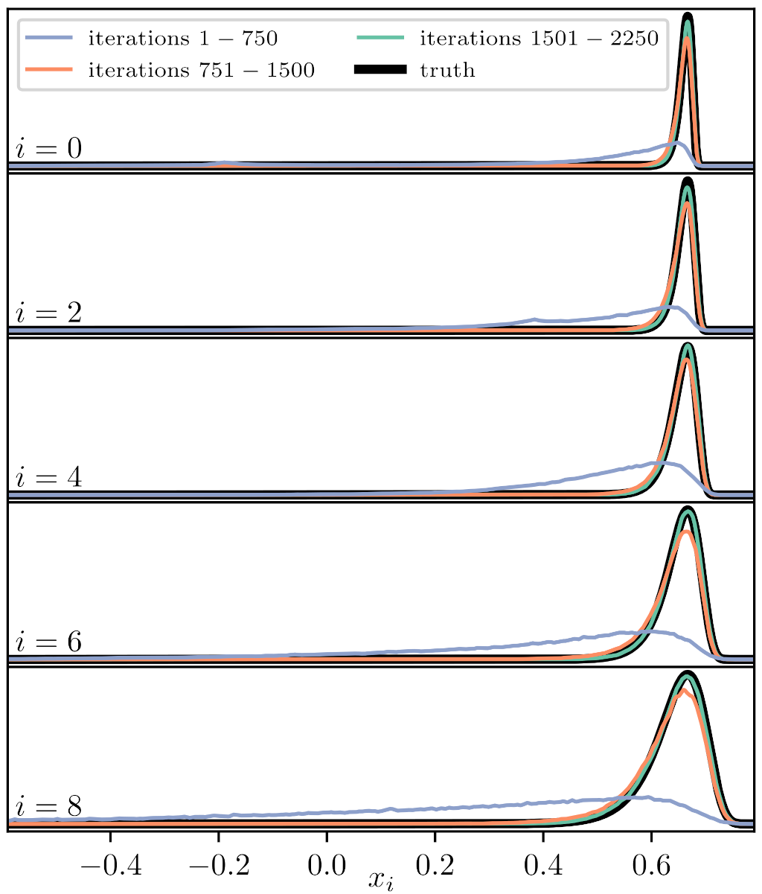

# Using nested samping outputs to initalize emcee
`e0.1_v8.txt` is an example nested sampling output from a 10-dimensional log-gamma test problem.

`resample.py` provides an example of how to resample nested sampling outputs to initialize walkers for an MCMC analysis.

`sample.py` can be used to sample a log-gamma distribution using emcee.

In practice, the MCMC run will look something like this if the the nested sampling analysis did not do a particularly good job of estimating the posterior: 

