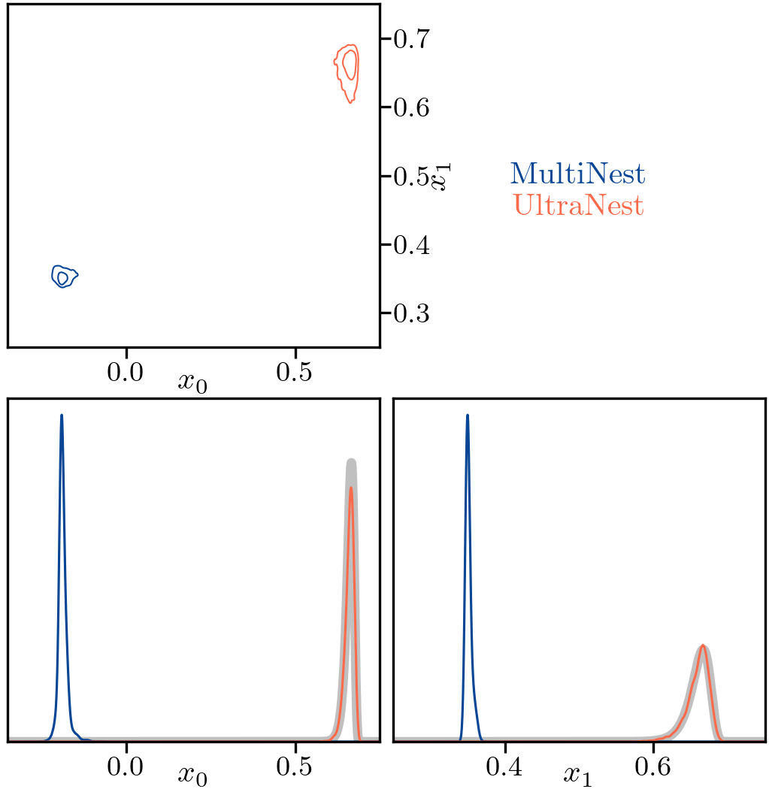

# Using nested samping outputs to warm-start UltraNest
`e0.1_v8.txt` is an example nested sampling output from a 10-dimensional log-gamma test problem, and `e0.1_v8_unit.txt` is a modified version of the same outputs,
made suitable for warm-starting an UltraNest analysis: the modifications consist of transforming parameter values to their unit-hypercube equivalents, multiplying 
the second MultiNest output column (which consists of of the log likelihoods of each combination multiplied by -2) by 0.5, and adding a header. 

`sample.py` can be used to sample a log-gamma distribution using emcee.

`warmstart.py` performs an UltraNest analysis, warm-started using the initial MultiNest analysis. 

Below is a comparison between the results of an initial MultiNest analysis and an UltraNest run warm-started using its outputs.

